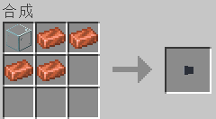
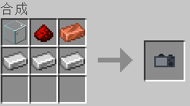
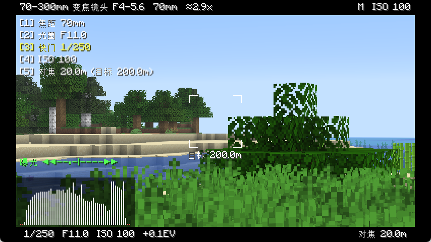
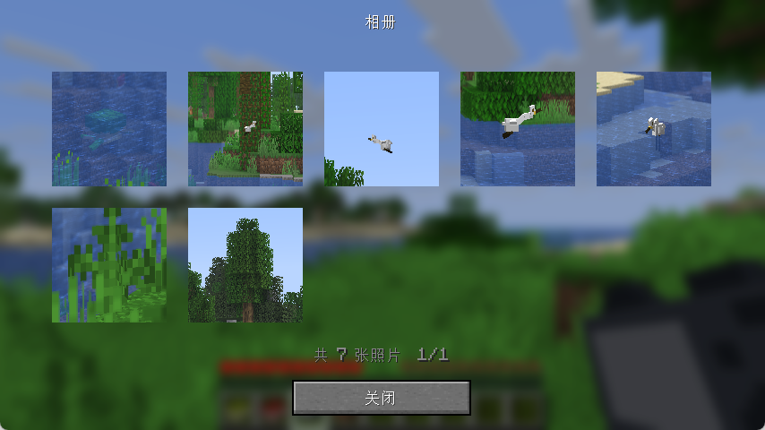
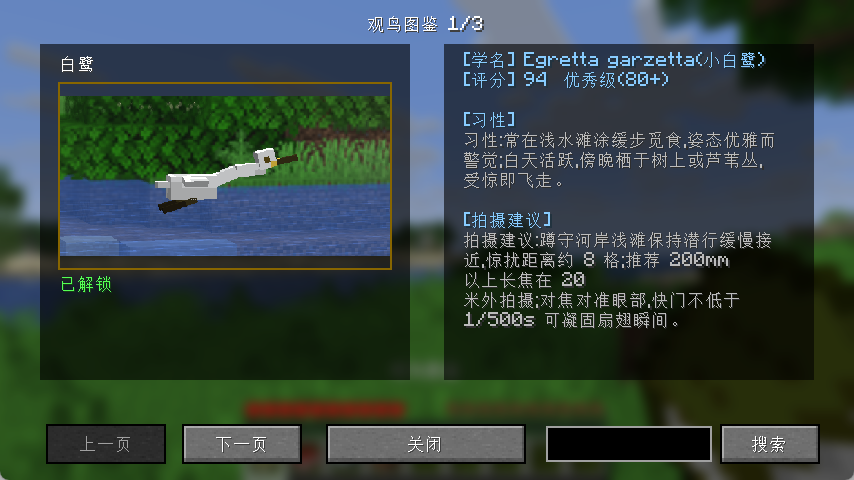
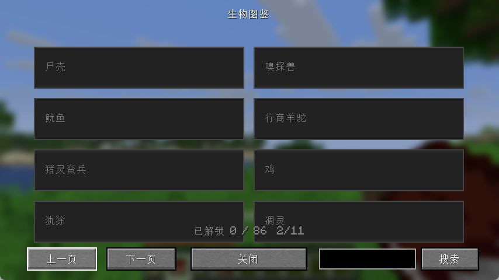

# BirdWatch 观鸟摄影模组

一个 ~~花了我 40 软妹币，15 亿token的~~ 休闲观鸟摄影模组：找鸟 → 调参 → 拍鸟 → 收集图鉴。支持 Fabric 26.2。

目前只加入了 3 种鸟类——白鹭、麻雀、山雀。

相机模拟了真实曝光、景深模糊，可调节对焦、光圈、快门、ISO、焦距，让你体验逼真的摄影过程 ~~（指不断的对焦、调曝光，刚对上焦鸟就飞走）~~ 。

## 依赖

- [Fabric API](https://modrinth.com/mod/fabric-api)
- [GeckoLib](https://modrinth.com/mod/geckolib)(动画库)

## 玩法总览

1. **拍摄**:手持相机右键进入取景器,调整参数对准鸟类按下快门,照片自动存入相册
2. **评分**:每张照片按六维标准评分(对焦/画面占比/运动模糊/噪点/遮挡/稳定性),≥60 分可解锁鸟图鉴
3. **印刷**:从相册选择照片,裁剪后消耗 1 张纸印刷成照片物品
4. **贴入图鉴**:把印刷照片贴入观鸟图鉴,解锁该鸟种条目
5. **生物图鉴**:用相机拍下原版生物即可解锁对应条目,集齐全部 86 种有成就

## 物品合成配方

### 镜头(无序合成,玻璃 + 铜锭,数量决定焦距)

> 无序合成:材料放进合成格任意位置即可,只看数量。

| 产物 | 材料 |
|---|---|
| 24mm 镜头(广角) | 玻璃 ×1 + 铜锭 ×1 |
| 50mm 镜头(标头) | 玻璃 ×1 + 铜锭 ×2 |
| 200mm 镜头(长焦) | 玻璃 ×1 + 铜锭 ×4 |
| 400mm 镜头(超长焦) | 玻璃 ×1 + 铜锭 ×8 |
| 70-300mm 变焦镜头 | 玻璃 ×2 + 铜锭 ×6 |

### 相机与图鉴(有序合成)

| 产物 | 配方 |
|---|---|
| 相机 | 第一行:玻璃 + 红石 + 铜锭;第二行:铁锭 ×3 |
| 观鸟图鉴 | 书 + 羽毛(无序) |
| 生物图鉴 | 书 + 皮革(无序) |

## 相机使用方法

### 基本操作

| 操作 | 功能 |
|---|---|
| 手持相机右键 | 进入/退出取景器 |
| 潜行 + 右键 | 打开镜头槽,装卸镜头 |
| 取景器内右键(或再次右键) | 按下快门拍照 |
| ESC | 退出取景器 |
| E(背包键) | 退出取景器并打开相册 |

### 参数调节(取景器内)

- **数字键 1-5** 选择当前调节项,顺序为:对焦 → 光圈 → 快门 → ISO → 焦距(变焦镜头)
- **鼠标滚轮** 调整选中项数值
- 取景器内实时显示曝光直方图,方便参考

### 镜头与识别距离

不同焦距的镜头决定了能识别/解锁多远的生物:

| 镜头 | 识别距离 |
|---|---|
| 24mm | 8m 内 |
| 50mm | 约 31m |
| 200mm | 约 101m |
| 400mm | 200m |
| 70-300mm 变焦 | 按当前焦距约 33-142m |

> 想拍远处的鸟/生物,换上更长的镜头;广角镜头需要贴近目标。

## 图鉴系统

### 观鸟图鉴(鸟)

1. 拍出评分 ≥60 的鸟照 → 相册中选择照片 → **印刷**(消耗 1 张纸,可裁剪)
2. 手持印刷照片右键预览,或直接在图鉴条目页点击照片槽贴入
3. 贴入后该鸟种解锁:显示全貌、习性、拍摄建议;更换照片时旧照片会返还
4. 图鉴支持翻页与搜索(按 id/中文名/学名)

### 生物图鉴(原版生物)

- 开局自带,与观鸟图鉴分开
- 用相机拍到生物即解锁对应条目(受镜头识别距离限制)
- 覆盖全部 86 种原版生物,解锁后显示习性描述

## 成就

| 成就 | 条件 |
|---|---|
| 初试身手 | 拍下第一张照片 |
| 图鉴开篇 | 贴入第一张印刷照片 |
| 博物学者 | 相机收录全部原版生物 |
| 每鸟三档 | 各鸟解锁 / 优秀(80+) / 完美(95+) |

## 多人模式

- 照片存在各自客户端,玩家间不可见
- 印刷照片物品可交换、可放入展示框
- 图鉴解锁状态按玩家单独记录
- 拍摄判定纯客户端(休闲定位,无防作弊)
